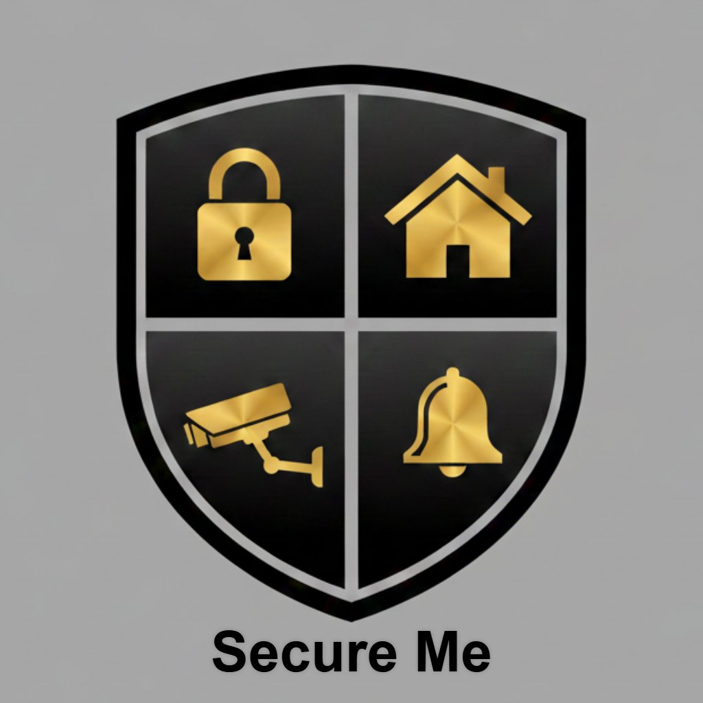

# 🛡️ Secure Me

<p align="center">
  
</p>

<p align="center">
  <strong>Professional Home Assistant Alarm System</strong><br/>
  Advanced security integration with multi-zone support, modular architecture, and intelligent automation
</p>

<p align="center">
  
  
  
  
</p>

---

## 🎯 Overview

**Secure Me** is a comprehensive alarm system integration for Home Assistant that goes beyond basic security. It features intelligent zone management, modular device control, and a beautiful configuration dashboard - all designed to provide professional-grade home security.

### Why Secure Me?

- 🏠 **Multi-Zone Control** - Manage different areas of your home independently
- 🔌 **Modular Architecture** - Optional modules for cameras, locks, lights, climate, sirens, and TTS
- 🎨 **Modern UI** - Beautiful configuration dashboard with real-time status
- 🚀 **Smart Automation** - Intelligent entry/exit delays, parallel execution, POE optimization
- 🔧 **Easy Setup** - GUI-based configuration, no YAML required
- 📱 **NFC Support** - Arm/disarm with NFC tags

---

## ✨ Key Features

### Core Alarm System
- **Multiple Arming Modes**: Away, Home, Night, Vacation
- **Entry/Exit Delays**: Configurable countdown timers
- **Code Protection**: PIN code validation with retry limits
- **Zone Management**: Group sensors by room/area
- **State Machine**: Robust state handling with proper transitions

### Smart Modules (6 included)

| Module | Purpose | Features |
|--------|---------|----------|
| 📷 **Camera** | POE & Recording | Auto POE control, recording modes, 120s optimization |
| 🔒 **Lock** | Smart Locks | Auto lock/unlock, retry logic, door sensor integration |
| 💡 **Lights** | Lighting Control | Auto on/off, emergency blinking, scene management |
| 🌡️ **Climate** | Heating/Cooling | Multi-zone climate, energy saving when away |
| 🚨 **Siren** | Alarm Sounds | Configurable volume, pattern, duration |
| 🔊 **TTS** | Voice Alerts | Danish voice messages, countdown announcements |

### Configuration Dashboard
- **7 Tabs**: Sensors, Zones, Users, Modules, Automations, Testing, Advanced
- **Real-time Status**: Live alarm state, zone status, module health
- **WebSocket API**: Fast bidirectional communication
- **Persistent Storage**: Configuration stored in `.storage/`
- **Dark Mode**: Beautiful UI that matches Home Assistant theme

---

## 📦 Installation

### Method 1: HACS (Coming Soon)

```
1. Open HACS
2. Go to "Integrations"
3. Click "+" and search for "Secure Me"
4. Click "Install"
5. Restart Home Assistant
```

### Method 2: Manual Installation

1. **Download the integration:**
   ```bash
   cd /config/custom_components/
   git clone https://github.com/kingpainter/secure-me.git secure_me
   ```

2. **Restart Home Assistant**

3. **Add the integration:**
   - Go to **Settings → Devices & Services**
   - Click **"+ Add Integration"**
   - Search for **"Secure Me"**
   - Follow the configuration wizard

---

## 🚀 Quick Start

### Basic Setup

1. **Configure Alarm Settings:**
   - Set your PIN code
   - Configure entry/exit delays (default: 30 seconds)
   - Choose which modules to enable

2. **Create Zones:**
   - Open Secure Me dashboard
   - Go to "Zoner" tab
   - Add zones (e.g., "Stue", "Soveværelse", "Køkken")
   - Assign sensors to each zone

3. **Add Sensors:**
   - Go to "Sensorer" tab
   - Add motion sensors, door/window contacts
   - Configure trigger delays per sensor

4. **Configure Modules:**
   - Go to "Moduler" tab  
   - Enable desired modules
   - Configure entities for each module

5. **Test the System:**
   - Use "Test" tab to verify all zones and modules
   - Test arm/disarm sequences
   - Check module responses

---

## 📖 Documentation

- [**FEATURES.md**](FEATURES.md) - Detailed feature descriptions
- [**STRUCTURE.md**](STRUCTURE.md) - Project architecture and file structure
- [**CHANGELOG.md**](CHANGELOG.md) - Version history and changes
- [**MODULE_KONFIGURATION_GUIDE.md**](MODULE_KONFIGURATION_GUIDE.md) - Module configuration guide
- [**ZONE_KONFIGURATION_GUIDE.md**](ZONE_KONFIGURATION_GUIDE.md) - Zone configuration guide

---

## 🏗️ Architecture

```
Secure Me Integration
│
├── 🎛️ Alarm Control Panel (Core)
│   ├── State Machine (disarmed ↔ armed_*)
│   ├── Entry/Exit Delays
│   └── Code Validation
│
├── 🗺️ Zone Manager
│   ├── Multi-zone support
│   ├── Sensor grouping
│   └── Zone-specific triggers
│
├── 🔌 Module System (6 modules)
│   ├── Camera Module
│   ├── Lock Module
│   ├── Lights Module
│   ├── Climate Module
│   ├── Siren Module
│   └── TTS Module
│
├── 🎨 Configuration Dashboard
│   ├── 7 tab interface
│   ├── WebSocket API
│   └── Persistent storage
│
└── 🤖 Automation Engine
    ├── Parallel execution
    ├── Event-driven triggers
    └── Module coordination
```

---

## 🎨 Screenshots

### Alarm Control Panel


### Configuration Dashboard


### Zone Management


---

## 🛠️ Configuration

### Alarm Settings

```yaml
# Configured through GUI
code: "1234"                # PIN code (4-6 digits)
exit_delay: 30             # Seconds before arming
entry_delay: 30            # Seconds before triggering
```

### Example Module Configuration

See [MODULE_KONFIGURATION_GUIDE.md](MODULE_KONFIGURATION_GUIDE.md) for complete configuration options.

```json
{
  "modules": {
    "camera": {
      "enabled": true,
      "poe_switches": ["switch.poe_port_1"],
      "cameras": ["camera.front_door"],
      "poe_delay": 120
    },
    "lock": {
      "enabled": true,
      "locks": ["lock.front_door"],
      "lock_on_arm": true
    }
  }
}
```

---

## 🔧 Advanced Features

### NFC Tag Support
Arm/disarm the alarm using NFC tags:
```yaml
# Tag events automatically trigger actions
event_type: tag_scanned
event_data:
  tag_id: "YOUR_TAG_ID"
```

### Parallel Execution
Modules execute simultaneously for faster response (saves ~120s on POE cameras).

### POE Optimization
Smart POE management - checks if already powered before waiting.

### Battery Tracking
Monitor battery levels of 17+ wireless sensors.

---

## 🧪 Testing

The integration includes a comprehensive testing framework:

1. **Unit Tests** - Test individual components
2. **Integration Tests** - Test module interactions
3. **Dashboard Tests** - Interactive testing via UI
4. **Health Monitoring** - System diagnostics

Run tests via the Testing tab in the configuration dashboard.

---

## 🤝 Contributing

Contributions are welcome! Please read [CONTRIBUTING.md](CONTRIBUTING.md) for details on our code of conduct and the process for submitting pull requests.

### Development Setup

```bash
# Clone the repository
git clone https://github.com/kingpainter/secure-me.git
cd secure-me

# Create development environment
python -m venv venv
source venv/bin/activate  # On Windows: venv\Scripts\activate
pip install -r requirements_dev.txt

# Run tests
pytest tests/
```

---

## 📝 Changelog

See [CHANGELOG.md](CHANGELOG.md) for a detailed version history.

### Latest Version: 0.2.0 (Phase 2 Complete)

**New in 0.2.0:**
- ✅ 6 modules implemented (camera, lock, lights, climate, siren, tts)
- ✅ Configuration dashboard with 7 tabs
- ✅ WebSocket API for real-time communication
- ✅ Persistent storage system
- ✅ NFC tag integration
- ✅ Parallel module execution

---

## 🐛 Known Issues

- Options flow UI not yet implemented (use YAML configuration)
- Testing framework UI in progress
- HACS submission pending

See [GitHub Issues](https://github.com/kingpainter/secure-me/issues) for the full list.

---

## 🗺️ Roadmap

### Phase 3: Polish & Testing (In Progress)
- [ ] Complete testing framework
- [ ] Health monitoring dashboard
- [ ] Battery tracking UI
- [ ] HACS submission
- [ ] Complete translations

### Phase 4: Production (Target: v1.0.0)
- [ ] Options flow UI
- [ ] Advanced automation builder
- [ ] Mobile app integration
- [ ] Cloud backup/restore
- [ ] Multi-home support

---

## 📄 License

This project is licensed under the MIT License - see the [LICENSE](LICENSE) file for details.

---

## 👏 Acknowledgments

- Home Assistant community for inspiration and support
- Alarmo integration for reference implementation
- Material Design Icons for beautiful icons
- All contributors and testers

---

## 📞 Support

- **Issues**: [GitHub Issues](https://github.com/kingpainter/secure-me/issues)
- **Discussions**: [GitHub Discussions](https://github.com/kingpainter/secure-me/discussions)
- **Documentation**: [Full Documentation](https://github.com/kingpainter/secure-me/wiki)

---

## ⭐ Star History

If you find this project useful, please consider giving it a star on GitHub!

---

<p align="center">
  Made with ❤️ by <a href="https://github.com/kingpainter">KingPainter</a><br/>
  <sub>Professional Home Alarm Manager for Home Assistant</sub>
</p>
